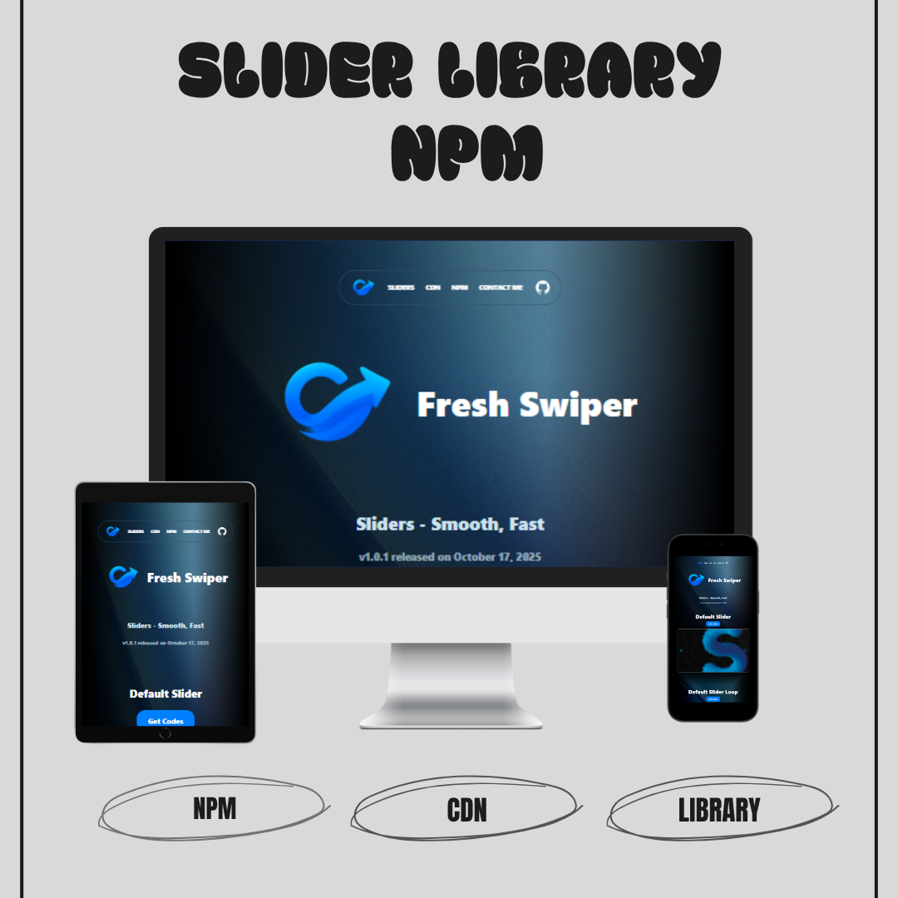
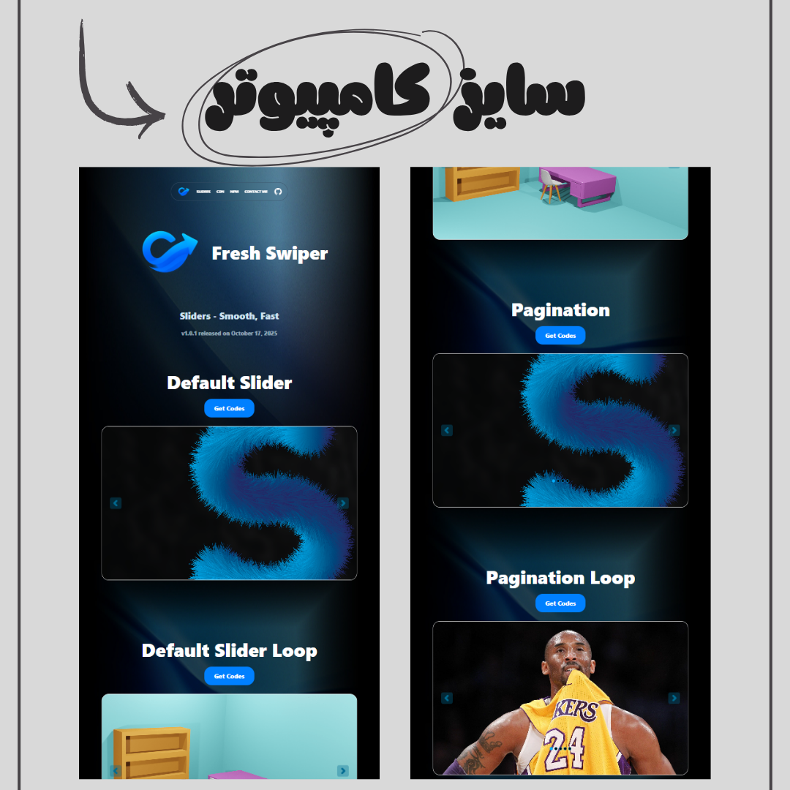
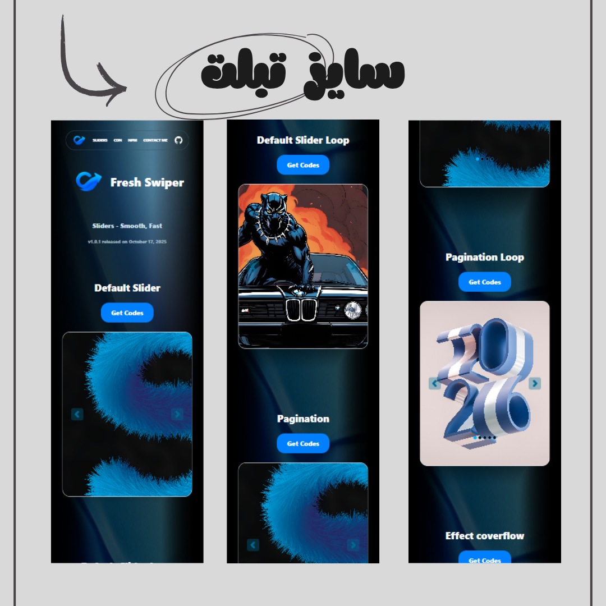

# 🎡 Fresh Swiper v1.0.1

A modern, responsive, and fully looped **3D Swiper/Carousel library** built with pure JavaScript and CSS.  
Easily create **interactive sliders** with unique animations, dynamic perspectives, and smooth transitions — no external dependencies required! ✨

---

## 🚀 Overview

**Fresh Swiper** is a lightweight and flexible slider library that brings your images to life with **3D movement**, **loop animations**, and **custom transitions**.  
Simply drop your HTML, include the library, and enjoy instant magic. 🔮

---

## 🌐 Live Demo

👉 [View Live Demo](https://parsa-farshah.github.io/fresh-swiper/)

👉 [View on NPM](https://www.npmjs.com/package/freshswiper)

---

## ✨ Features

- 🌀 Smooth 3D Swiper animation
- 🔁 Infinite Loop (auto & manual control)
- ⚙️ Fully customizable and responsive
- 💡 Easy to implement with minimal setup
- 🚀 No external dependencies (pure JS + CSS)
- 🎨 Modern UI with Tailwind-friendly structure

---

## 📅 Release Date

**October 14, 2025**

---

## 🛠️ Technologies Used

- **HTML5** – semantic structure
- **CSS3** – advanced 3D transform & responsive design
- **JavaScript (Vanilla JS)** – animation logic & event handling
- **Tailwind CSS Ready** – compatible with utility-first workflows

---

## 🎨 Example Usage

```html
<div class="freshWrapperCarouselSliderSevenLp rounded-3xl mt-10">
  <!-- btn right -->
  

  <!-- btn left -->
  

  <!-- Example Slides -->
  <div
    class="freshSwiperCarouselSliderSevenLp CarouselSliderSevenLp1 duration-500"
    data-tartib="9"
  >
    
  </div>

  <div
    class="freshSwiperCarouselSliderSevenLp CarouselSliderSevenLp2 duration-500"
    data-tartib="10"
  >
    
  </div>

  <div
    class="freshSwiperCarouselSliderSevenLp CarouselSliderSevenLp3 duration-500"
    data-tartib="11"
  >
    
  </div>
</div>

🖼️ Project Screenshots 🌟 Overview


💻 Desktop View


📱 Mobile View


👨‍💻 Developed By [parsa dehghan pour
farashah](http://linkedin.com/in/parsa-dehghan-pour-farashah-85ab04250) ## 👨‍🏫
Supervisor - This project was completed under the guidance of my academic
supervisor: 🔗 [Parsa Ghorbanian's Website](https://trainingsitedesign.ir/) -
thanks to 🔗 [mehrab Pour zakaria's Website](https://pourzakaria.com/) for
helping upload to the npm site 

## 📲 Connect with Me | ارتباط با من 

- 📸 Instagram:
[@parsa_dehghanpour_dv](https://www.instagram.com/parsa_dehghanpour_dv?igsh=eHkwNWhsa3I4ZWVp)

- 💼 LinkedIn: [parsa dehghan pour
farashah](http://linkedin.com/in/parsa-dehghan-pour-farashah-85ab04250)

 - 💻 GitHub: [parsa-farshah](http://github.com/parsa-farshah)
 
- 📩 Email: parsafarashah2002@gmail.com 
- 📺 YouTube:[@FrontEndFresh](https://youtube.com/@frontendfresh?si=-2WsIYe-KBTUfwyu) 

--- 📦

Installation 🔹 Using NPM bash Copy code npm i freshswiper Then include the
library in your HTML: html Copy code
<link
  rel="stylesheet"
  href="node_modules/fresh-animation/dist/freshswiper.min.css"
/>
<script src="node_modules/fresh-animation/dist/freshswiper.min.js"></script>
🔹 Using CDN html Copy code
<link
  rel="stylesheet"
  href="https://unpkg.com/fresh-typedjs@1.0.1/dist/freshswiper.min.css"
/>
<script src="https://unpkg.com/fresh-typedjs@1.0.1/dist/freshswiper.min.js"></script>


🧩 Key Classes Class Name Description .freshWrapperCarouselSliderSevenLp Main
container for the swiper .freshSwiperCarouselSliderSevenLp Each individual slide
wrapper .btnRightCarouselSliderSevenLp / .btnLeftCarouselSliderSevenLp
Navigation buttons .CarouselSliderSevenLp2 The main centered active slide
.CarouselSliderSevenLpMinus* / .CarouselSliderSevenLp* Slide position classes
controlling 3D depth 

🏷️ License Released under the MIT License.

```
